# NusaIndex

**Bahasa Indonesia** | [English](https://github.com/haikalmumtaz233/nusaindex/blob/main/README.en.md)

[](https://www.npmjs.com/package/nusaindex)
[](https://pkg.go.dev/github.com/haikalmumtaz233/nusaindex)
[](https://github.com/haikalmumtaz233/nusaindex/blob/main/LICENSE)

Cek, baca, dan format data Indonesia, lengkap dengan data referensi yang selalu terbaru. Untuk Go, TypeScript, terminal, dan agent AI.

NIK, NPWP (termasuk format 16 digit dan NITKU), nomor HP, plat nomor, NIP, NISN, kode bank, wilayah sampai desa, libur nasional dan cuti bersama, hari kerja, dan Rupiah.

Dokumentasi lengkap dan playground ada di **[nusaindex.haikalmumtaz.com](https://nusaindex.haikalmumtaz.com)**.

> Tidak resmi. Tidak berafiliasi dengan Dukcapil, DJP, Komdigi, Polri, Bank Indonesia, atau instansi pemerintah mana pun.



## Fitur

- Library Go dan TypeScript asli dengan API yang sama dan hasil yang identik, dikunci oleh test vector bersama
- Tanpa dependensi runtime dan jalan offline, jadi data penggunamu tidak pernah keluar dari aplikasi
- Baca isi nomor: wilayah, tanggal lahir, dan jenis kelamin dari NIK, atau merek dan operator dari nomor HP
- Data wilayah dari Kepmendagri terbaru, kode lama hasil pemekaran otomatis diarahkan ke kode baru, dan setiap dataset tercatat sumbernya di `data/manifest.json`
- Libur, cuti bersama, dan hitungan hari kerja untuk gajian, SLA, dan jatuh tempo
- Format dan terbilang Rupiah, masking data pribadi untuk log, dan data uji yang realistis
- Skema Zod dan Valibot, CLI, dan server MCP untuk agent AI

## Dipakai untuk apa

Formulir layanan publik dan website pemda, pendaftaran sekolah, fintech dan e-commerce, HR dan penggajian, logistik, kepatuhan UU PDP, pengujian, sampai chatbot. Contoh lengkapnya ada di halaman [Kegunaan](https://nusaindex.haikalmumtaz.com/use-cases/).

## Yang tidak dilakukan

NusaIndex cuma mengecek apakah sebuah nomor strukturnya benar. Ia tidak bisa memastikan NIK, NPWP, plat, atau nomor HP itu asli, apalagi siapa pemiliknya. Untuk itu pakai layanan verifikasi resmi.

## Instalasi

Go 1.25 ke atas:

```sh
go get github.com/haikalmumtaz233/nusaindex
```

Node.js 22.18 ke atas, Bun, Deno, edge runtime, atau browser modern:

```sh
npm install nusaindex
pnpm add nusaindex
bun add nusaindex
deno add npm:nusaindex
```

## Mulai cepat

```go
person, err := nik.Parse("3273275705901349")
if err == nil {
	fmt.Println(person.BirthDate, person.Sex)
}
```

```ts
import * as nik from "nusaindex/nik";

const person = nik.parse("3273275705901349");
if (person.ok) {
  console.log(person.value.birthDate, person.value.sex);
}
```

Dua-duanya mencetak `1990-05-17 female`. Fungsi yang gagal tidak pernah melempar exception. Go mengembalikan `error`, TypeScript mengembalikan `{ ok: false, error }`. Semua nomor di README ini dibuat dengan `fake`.

## Status

Stabil sejak v1.0.0. API publik mengikuti [Semantic Versioning](https://semver.org/lang/id/), dan pembaruan data karena regulasi baru dirilis sebagai versi patch.

## Command line

Paket `nusaindex` sudah termasuk perintah `nusaindex` (alias `nusa`):

```sh
nusaindex nik 3171014501909999
nusaindex rupiah terbilang 1500000.5
nusaindex region search gambir --level district
nusaindex workday add 2026-08-14 3
nusaindex mask text --stdin < app.log > app.redacted.log
nusaindex nik --csv --column nik < customers.csv
```

Argumen bisa tersimpan di riwayat shell, jadi kirim data asli lewat `--stdin` atau `--csv`. Tambahkan `--json` kalau hasilnya mau dibaca program lain. Exit code-nya `0` kalau semua nilai valid, `1` kalau ada yang tidak valid, dan `2` kalau perintahnya salah.

## Server MCP

`nusaindex-mcp` membuka fitur yang sama untuk agent AI lewat stdio, dengan sepuluh tool yang cuma membaca:

```json
{
  "mcpServers": {
    "nusaindex": { "command": "npx", "args": ["-y", "nusaindex-mcp"] }
  }
}
```

Di Claude Code cukup satu perintah:

```sh
claude mcp add nusaindex -- npx -y nusaindex-mcp
```

Kalau Claude Desktop di Windows gagal menjalankan `npx`, pakai `"command": "cmd"` dengan `"args": ["/c", "npx", "-y", "nusaindex-mcp"]`.

Apa pun yang kamu ketik di chat AI sudah terkirim ke penyedia AI sebelum sampai ke server lokal ini, jadi pakai tool `fake` untuk demo.



## Library validasi

Skema TypeScript ada di subpath tersendiri, jadi `zod` dan `valibot` tetap jadi peer dependency opsional:

```ts
import { z } from "zod";
import * as id from "nusaindex/zod";

const Customer = z.object({ nik: id.nik(), phone: id.phone(), deposit: id.rupiah() });
```

`nusaindex/valibot` punya fungsi yang sama. Pesan error tidak pernah memuat input.

Di Go, daftarkan fungsi `Valid` ke [go-playground/validator](https://github.com/go-playground/validator). NusaIndex sendiri tidak bergantung padanya:

```go
validate := validator.New()
_ = validate.RegisterValidation("nik", func(fl validator.FieldLevel) bool {
	return nik.Valid(fl.Field().String())
})

type Customer struct {
	NIK string `validate:"required,nik"`
}
```

## Data uji

`fake` (paket Go, atau `nusaindex/fake` di TypeScript) membuat NIK, NPWP, nomor HP, NIP, NISN, dan plat yang strukturnya valid dari sebuah seed, dengan hasil yang sama di Go dan TypeScript. Cuma untuk pengujian, karena nomornya bisa saja milik orang sungguhan.

## Keamanan

Laporkan celah keamanan secara privat lewat tombol **Report a vulnerability** di tab Security. Detailnya ada di [SECURITY.md](https://github.com/haikalmumtaz233/nusaindex/blob/main/SECURITY.md).

## Lisensi

[MIT](https://github.com/haikalmumtaz233/nusaindex/blob/main/LICENSE), untuk kode maupun data. Sumber dan regulasi tiap dataset tercatat di [NOTICE](https://github.com/haikalmumtaz233/nusaindex/blob/main/NOTICE) dan `data/manifest.json`.
